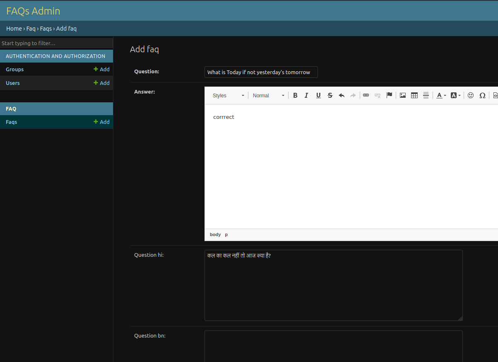
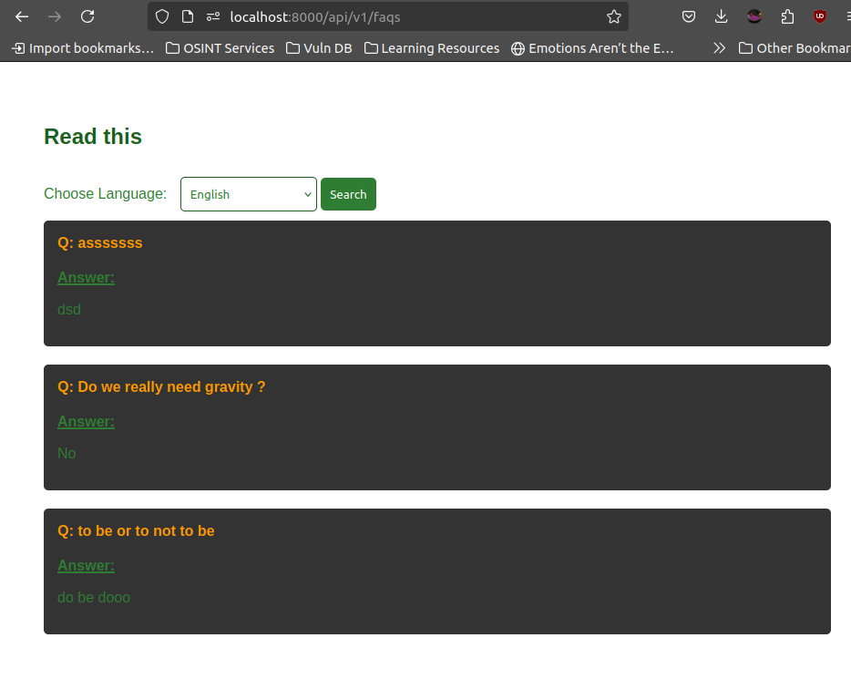

# BharatFD assigment - Multilingual FAQ System


## Overview
This **FAQ Management API** is a Django based REST API which allows users to manage and retrieve FAQs. It supports 3 languages and caching for better performance.

### Admin interface



### Faq page



## Tech Stack
- **Backend**: Django, Django REST Framework 
- **Database**: PostgreSQL
- **Caching**: Redis
- **Testing**: Pytest, Django Test Client

## Installation

### Prerequisites
- Python 3.10+
- PostgreSQL (or SQLite)
- Redis 
- Docker

### Setup Instructions

1. **Clone the repository**:
   ```bash
   git clone https://github.com/yourusername/faq-management.git
   cd faq-management

2. **Create a virtual environment**:
```bash
    python -m venv venv
    source venv/bin/activate # linux  
```
3. **Install dependencies**:
```bash
    pip install -r requirements.txt
```
4. **Setup db and runserver**:
```bash
    python manage.py migrate
    docker compose up -d
    python manage.py runserver
```

5. **Access admin interface**:
```bash
    http://localhost:8000/admin
    # user - admin
    # pass - qwerty
```


## API

GET http://localhost:8000/api/v1/faqs/

### Response

```json
    {
    "count": 3,
    "next": null,
    "previous": null,
    "results": [
        {
            "id": 1,
            "question": "To be or not to be",
            "answer": "Yes"
        },
        {
            "id": 2,
            "question": "What is Today but not yesterday's tomorrow",
            "answer": "Sir ..pls"
        },
        
    ]
}
```
GET http://localhost:8000/api/v1/faqs/?lang={preffered_lang}

For "hi" lang parameter, response is like

```json
    {
    "count": 3,
    "next": null,
    "previous": null,
    "results": [
        {
            "id": 1,
            "question": "क्या आप जानते हैं ?",
            "answer": "क्यों"
        },
    ]
}

```

